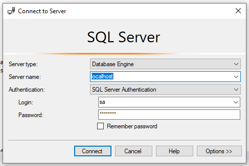
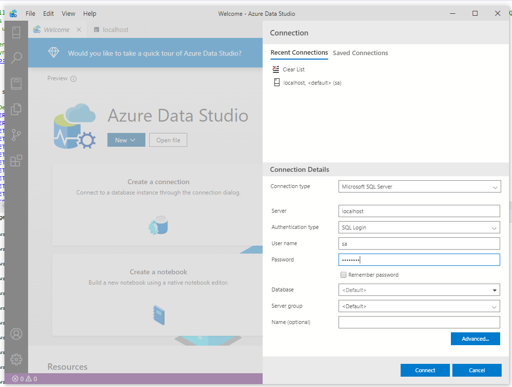

# MS SQL Server in a Docker container
1. download `docker-compose.yml`
2. run command from terminal: `docker-compose up`
3. connect with [SQL Server Management Studio](#ms-sql-server-management-studio) or [Azure Data Studio](#ms-azure-data-studio) or other

Want to configure? [Follow me](#configure)

## MS SQL Server Management Studio
The login screen should look like this:



- [Download SQL Server Management Studio](https://docs.microsoft.com/en-us/sql/ssms/download-sql-server-management-studio-ssms)
## MS Azure Data Studio
First click on "Create a connection" 

The login screen should look like this:



- [Download Azure Data Studio](https://docs.microsoft.com/en-us/sql/azure-data-studio/download-azure-data-studio)

# Configure
- [Change the exposed port](#change-the-exposed-port)
- [Change the Database password](#change-the-database-password)
## Change the exposed port
The default port (1433) of SQL Server is used.
This can be changed, by changing the line rigth after `ports:` in `docker-compose.yml`.

To change to port 1401 write:
```yml
    ports:
      - 1401:1433
```
Only change the number before `:1433`

## Change the Database password
The password in this `docker-compose.yml` is set to my Github username, which is a bad choice for password. To change it, open `docker-compose.yml` in a text editor. 

Change the password after `- SA_PASSWORD=`
```yml
    environment:
      - ACCEPT_EULA=Y
      - SA_PASSWORD=Your_Secure_Password
```
# Sources:
- https://hub.docker.com/_/microsoft-mssql-server