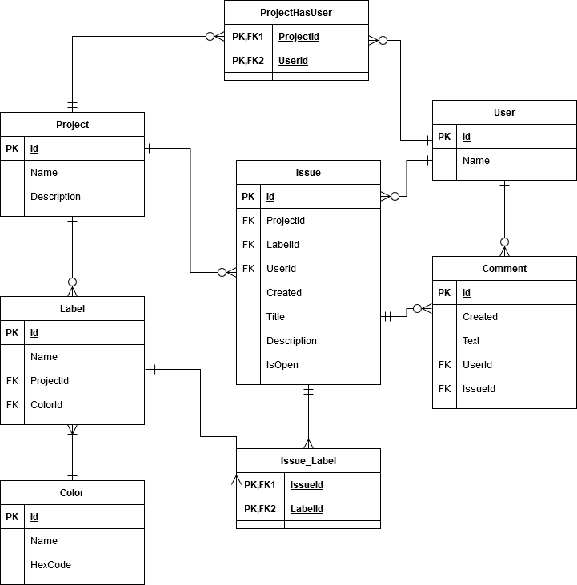

# Assignments
## Task 3.1
IssueTrackerDB
1. Create a physical ER Diagram of the mockups. ==>[JUMP to picture](#picture)
2. Create the Database ==> [SQL](./IssueTracker.sql)
3. == Not needed ==

## Task 3.2
WideWorldImporters DB
1. Write 3 SQL queries (using between 2-4 tables)  ==> [SQL](./WWI-joins.sql)
2.  == Not needed ==
3. Solve at least 6 queries from other students   ==> [SQL](./WWI-joins-answers.sql)

## Task 3.3
PetHospital
1. Turn a table (e.g. Treatment Price) in your pethospital database into a system-versioned Temporal Table  ==> [SQL](./Task33Alter.sql)
 * [Link to change table to Temporal table](https://www.databasejournal.com/features/mssql/altering-an-existing-table-to-support-temporal-data.html)
2. Update some data
3. Create a query that uses the historic data
*   2. and 3. ==> [SQL](./Task33Updatedata.sql)

## Picture

